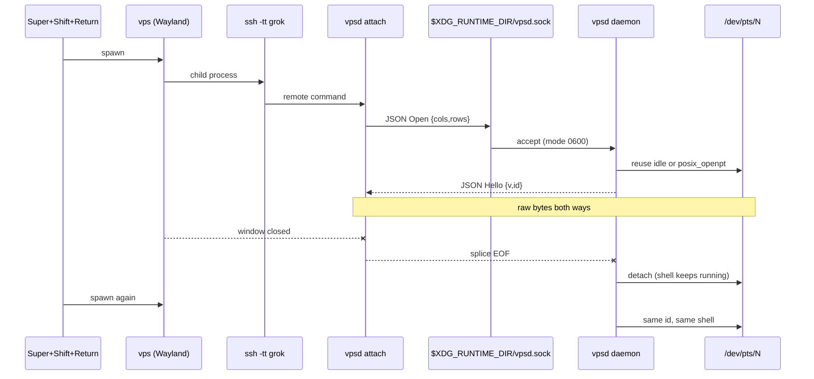

# vps

[](https://www.rust-lang.org/)
[](LICENSE)
[](#threat-model)

A **native Wayland window** on the laptop, a **real POSIX PTY** on grok, and **nothing listening on the network**. Super+Shift+Return should feel like Super+Return — except the shell is over there.

```
Super+Shift+Return  →  vps  →  ssh -tt grok vpsd attach  →  /dev/pts/N
```

---

## Contents

- [Why this exists](#why-this-exists)
- [How it works](#how-it-works)
- [Threat model](#threat-model)
- [Install](#install)
- [Daily use](#daily-use)
- [Configuration](#configuration)
- [Protocol](#protocol)
- [Crates](#crates)
- [Development](#development)

---

## Why this exists

| Thing | Close, but |
| --- | --- |
| WezTerm mux over SSH | Unix socket *through* SSH — you have to run WezTerm |
| Eternal Terminal | `etserver` binds **TCP :2022** |
| ssh-obi | SSH-stdio + Unix socket, early crate, not a native window |
| mosh | One UDP PTY; **must** bind 60000–61000 |
| zellij / tmux | Nested UI, not an OS window |
| `kitty -e mosh` | Scripts around someone else's emulator |

None of those is: niri `app-id=vps`, red ground, Super+Shift+Return, PTY owned on grok, **no TCP/UDP bind**.

Mosh is the wrong *tunnel for a mux*. It **is** a PTY, and it has to listen on UDP. The mux tunnel is **SSH** (your existing `Host grok` ControlMaster). `ssh grok` without a command is still zellij `grok-build`; this app does not steal that.

---

## How it works



1. **`vps`** is an iced window (`iced_term` + `alacritty_terminal`). It is a real terminal emulator, not kitty wrapping a script. App id `vps`. Palette is Irongall with the ground shifted red.
2. Its child is **OpenSSH**: `ssh -tt grok '/home/tj/.local/bin/vpsd attach'`. `-tt` forces a remote tty. ControlMaster on `Host grok` makes the extra hop cheap.
3. **`vpsd attach`** requires a tty. It connects to the **Unix socket** the daemon bound (never a port).
4. **`vpsd daemon`** (systemd `--user` on grok) owns the PTY table and a **scrollback ring** of PTY output (`scrollback_bytes`). `open` creates a PTY; `attach --id` reconnects.
5. Closing the window ends the SSH splice. The daemon **detaches**; the shell keeps running. Shell reattach **replays** stored output. **TUI apps (Grok’s logo, vim)** skip that replay — dumping megabytes of animation frames kills the new window — and get a SIGWINCH so they redraw the current screen.

`SSH_CONNECTION` is stripped from the login shell so `~/.bashrc.d/zellij.sh` does not `exec zellij` on these PTYs.

---

## Threat model

`vpsd` **will not bind TCP or UDP**. `Listen::parse("0.0.0.0:2022")` is a tested error. The only bind is a Unix socket, mode `0600`, under `$XDG_RUNTIME_DIR`.

The laptop reaches it **only** as a command inside an existing SSH session (`ssh -tt grok vpsd attach`). Grok's nftables already accept SSH only on `wg0`. This app does not add a public port.

| Path | Bound? |
| --- | --- |
| `$XDG_RUNTIME_DIR/vpsd.sock` | yes, 0600 |
| `0.0.0.0:any` | refused |
| UDP 60000–61000 | not used |

---

## Install

### Laptop

```bash
cd ~/Projects/vps
cargo test --workspace
cargo build --release --workspace
install -m0755 target/release/vps  ~/.local/bin/vps
install -m0755 config/config.toml  ~/.config/vps/config.toml   # edit as needed
```

niri (already bound):

```kdl
Super+Shift+Return repeat=false { spawn "vps"; }
```

### Grok

```bash
scp target/release/vpsd grok:~/.local/bin/vpsd
scp config/vpsd.toml    grok:~/.config/vps/vpsd.toml
scp packaging/vpsd.service grok:~/.config/systemd/user/vpsd.service
ssh grok 'systemctl --user daemon-reload && systemctl --user enable --now vpsd.service'
```

Replace a running binary: `systemctl --user stop vpsd` first (ETXTBSY otherwise).

---

## Daily use

| You do | What happens on grok |
| --- | --- |
| Super+Shift+Return | `vps` lists PTYs over SSH (`vpsd list`). If any exist, a picker. If none, a new PTY. |
| Close the window | SSH splice ends. **The PTY stays.** `grok` / builds / vim keep running. |
| Close the laptop | Same as close: SSH dies, daemon detaches, PTY stays. |
| Super+Shift+Return again | Picker: **idle** sessions you can reconnect, **live** ones already in another window, **+ new session**. |
| Enter on an idle row | `vpsd attach --id N` — shell: replayed `ls`; Grok/vim: redraw, not logo replay |
| `n` or **+ new session** | `vpsd attach --new` |
| Enter on a **live** row | takes over that PTY (other window, if any, detaches) |
| `ssh grok` | unchanged: zellij `grok-build` |

Picker keys: `↑↓` / `j k`, `enter`, `n` new, `s` settings, `esc` quit.

### Settings

| How | What |
| --- | --- |
| Super+Shift+Return, then `s` (or the **settings** row) | Settings screen in the same window |
| `vps settings` | Settings only (from any terminal) |
| Save | Writes `~/.config/vps/config.toml` |
| Cancel / `esc` | Back to the picker, or quit if you launched `vps settings` |

Font **family** is loaded at process start (`fc-match`). After changing it, quit and open `vps` again. Size/colors/ssh apply on the next attach in this process after save.

Optional niri bind:

```kdl
Super+Shift+Comma repeat=false { spawn "vps" "settings"; }
```

There is no auto-grab of “the first idle PTY.” You choose.

---

## Configuration

TOML only. Two files — the machines are different.

| File | Host | Loaded by |
| --- | --- | --- |
| [`config/config.toml`](config/config.toml) → `~/.config/vps/config.toml` | laptop | `vps` |
| [`config/vpsd.toml`](config/vpsd.toml) → `~/.config/vps/vpsd.toml` | grok | `vpsd` |

Shipped copies are **the defaults**, commented. Every modifiable knob is a key. Restart `vps` / `vpsd` after edits.

### Client (`~/.config/vps/config.toml`)

| Table | Key | Default | What |
| --- | --- | --- | --- |
| `[ssh]` | `host` | `"grok"` | OpenSSH `Host` alias |
| `[ssh]` | `args` | `["-tt"]` | Extra argv before the host |
| `[ssh]` | `remote` | `"/home/tj/.local/bin/vpsd attach"` | **One** `$SHELL -c` string; `vps` appends `--new` / `--id N` |
| `[ssh]` | `list` | `"/home/tj/.local/bin/vpsd list"` | JSON session list, no tty |
| `[ssh]` | `list_args` | `["-T"]` | ssh argv for the list hop |
| `[picker]` | `mode` | `"when_sessions"` | `when_sessions` / `always` / `never` |
| `[window]` | `width` / `height` | `1280.0` / `800.0` | Initial size (pixels) |
| `[window]` | `app_id` | `"vps"` | Wayland app id |
| `[font]` | `family` | `""` | fontconfig family; empty = `monospace` (kitty's default; Berkeley Mono here) |
| `[font]` | `size` | `14.0` | Glyph size in **pixels** (kitty IRONGALL is 14) |
| `[font]` | `scale` | `1.3` | Line height × `size` |
| `[font]` | `extras` | `["MesloLGS Nerd Font"]` | Extra families loaded for nerd/symbol glyphs |
| `[term]` | `term` | `"xterm-256color"` | `$TERM` |
| `[term]` | `colorterm` | `"truecolor"` | `$COLORTERM` |
| `[colors]` | `background` | `"#241018"` | Red-shifted Irongall ground |
| `[colors]` | `foreground`, `black`…`white`, `bright_*`, `dim_*` | (see file) | Full 16-colour + dim set |
| `[colors]` | `bright_foreground` | unset | Optional override |

iced does not talk to fontconfig. `vps` runs `fc-match` (the same database kitty uses), reads the TTF/OTF files, and registers them with iced. Empty `family` is fontconfig `monospace`.

`ssh.remote` must stay a **single** string. OpenSSH concatenates extra argv with spaces and passes the result to `$SHELL -c`. Splitting `vpsd` and `attach` makes bash treat `attach` as a leftover argument; you get `vpsd` help and the window dies.

### Daemon (`~/.config/vps/vpsd.toml`)

| Key | Default | What |
| --- | --- | --- |
| `listen` | `""` → `$XDG_RUNTIME_DIR/vpsd.sock` | Unix path only |
| `shell` | `"/bin/bash"` | `bash -l` on **new** PTYs |
| `socket_mode` | `"0600"` | Octal digits, user rw only |
| `scrollback_bytes` | `2097152` (2 MiB) | PTY output kept so reattach can replay the screen |

CLI overrides: `vpsd daemon --listen /run/user/1000/vpsd.sock`. Anything that looks like `host:port` / `tcp:` / `udp:` is rejected.

---

## Protocol

JSON, one object per line, then raw PTY bytes. Control never shares a TCP port.

```json
{"t":"open","cols":80,"rows":24}
{"t":"hello","v":1,"id":3}
```

```json
{"t":"list"}
{"t":"sessions","sessions":[{"id":1,"pts":"/dev/pts/4","pid":9,"attached":false,"cwd":"/home/tj","command":"grok"}]}
{"t":"attach","id":1,"cols":80,"rows":24}
```

After `hello`, both sides splice 8-bit data. Client EOF → daemon **detaches** (shell stays). PTY master EOF → session dropped. `open` always creates a new PTY; reconnect is `attach` by id.

---

## Crates

| Crate | Role |
| --- | --- |
| `vps-protocol` | JSON messages + listen-address policy |
| `vpsd` | Daemon + `attach` broker |
| `vps` | iced GUI |

---

## Development

```bash
cargo test --workspace
cargo clippy --workspace --all-targets -- -D warnings
cargo fmt
```

Persistence is covered by `persist_session_across_disconnect` (Unix socket, no SSH). TCP refusal is `listen_rejects_tcp`. A real `posix_openpt` path is `openpty_is_a_real_pts`.
